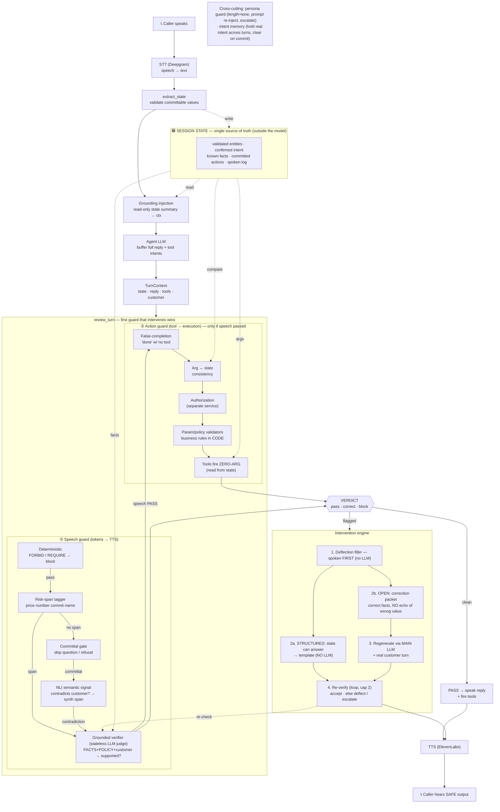

# plivo-mirror v4 — full runtime flow (in depth)

> Two views: an editable **Excalidraw** scene (`v4_flow.excalidraw` — open at excalidraw.com → *Open*) and the **Mermaid** diagram below (renders on GitHub). Then a step-by-step narrative of exactly what happens on one turn.

## Diagram

## What happens on one turn (step by step)

1. **Caller speaks → STT.** Deepgram turns audio into the customer's text.

2. **State grounding (the structural backbone).** `extract_state` pulls *committable* values out of the caller's turn (amounts, dates, on-menu items…), **validates** them, and writes them to **`SessionState`** — which lives **outside the model's context**. This is the single source of truth. *(v4's first defense: the model never owns the truth.)*

3. **Grounding injection.** A read-only summary of confirmed state (+ any held intent / persona re-injection) is injected into the chat context every turn — so the agent is reminded of the facts, but can't mutate them.

4. **Agent LLM.** The model produces its planned reply (and any tool intents). The adapter **buffers the whole stream** so both guards can inspect the full reply before a word is voiced. A `TurnContext` bundles `{state, planned_reply, tool_intents, customer_text}`.

5. **`review_turn` — the dual boundary.** Speech guard runs first; **the first guard that intervenes wins** and the pending tool calls are dropped.

   **① Speech guard** (tokens → TTS):
   - **Deterministic** — compiled `FORBID:`/`REQUIRE:` policy checks. A hard hit → **block** immediately (verifier never runs).
   - **Risk-span tagger** — flags consequential spans (prices, numbers, commitment words, names). *No span* → the zero-latency pass path… unless:
   - **Committal gate → NLI** — if the reply is *affirmative/committal* (not a question/refusal), the **semantic signal** (local cross-encoder NLI) asks "does this reply contradict the customer's stated request?" (ignored negation, dropped modifier). A contradiction synthesizes a flagged span. *(This gate is what stopped the over-firing on off-topic chatter found in live testing.)*
   - **Grounded verifier** — the only expensive call, on flagged spans only. A **separate, stateless** LLM-judge entailment call: *FACTS + POLICIES + customer request → supported?* Supported → **pass**; unsupported → **correct**. *(Stateless + separate = it can't rationalize the agent's own output.)*

   **② Action guard** (tool call → execution) — runs only if speech passed; deterministic, ~0 ms:
   - **False-completion** (claims "done" with no backing tool call), **arg↔state consistency** (proposed args vs validated state), **authorization separation** (a *separate service* decides what the caller may do — the prompt-injection defense), **param/policy validators** (business rules in code).
   - Tools then fire **zero-argument**: the executor reads validated values from state, never from the model.

6. **Verdict → act.**
   - **pass** → speak the reply + fire the tools.
   - **correct / block** → the **intervention engine**.

7. **Intervention (deflect → regenerate → re-verify).**
   - **Deflection filler** is yielded to TTS **first** (needs no LLM) — it's the "first beat" spoken while the real answer is produced, covering latency.
   - **Structured** (state can answer) → template the corrected reply from validated state, **no LLM**. **Open** → build a **correction packet** (the *correct* facts + the rule, framed so it **never restates the wrong value** — the pink-elephant guarantee) and re-prompt the **main LLM** with the *real* customer turn.
   - **Re-verify** the candidate back through the speech guard (+ echo check). Accept on pass; else regenerate (cap 2). On non-convergence: **deflect** (safe filler) by default, or escalate via warm handoff.

8. **TTS → caller hears the safe output.**

**Cross-cutting:** a **persona guard** tracks length + tone, re-injects a system-prompt summary at intervals, and escalates past a threshold; **intent memory** holds the caller's real intent across turns and auto-clears on commit.

## The six failures this flow defends (and where)
| failure | defended at |
|---|---|
| fabricated facts | grounded verifier + state grounding |
| unauthorized commitments | risk-span (commitment words) → verifier |
| wrong-action-vs-intent | action guard: arg↔state + zero-argument tools |
| compliance / disclosure gaps | deterministic `REQUIRE:` |
| prompt injection | authorization separation + zero-argument tools |
| persona drift | persona guard (length/tone, re-injection, escalation) |
